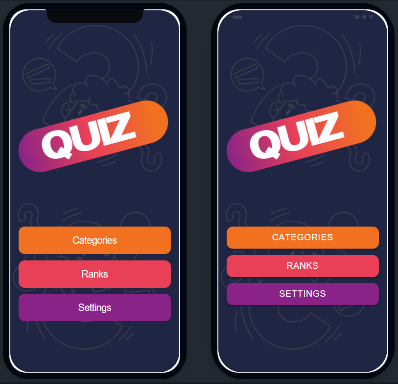

# my-quiz-app
 
Realized by Aksel Vaillant.    
CSE students at ENSIM - Le Mans Université [FRANCE]   
Under the direction of Mr. Denis Apparicio & Mr. Paul Cordon   

Made with Ionic and Trivia Api - https://core.telegram.org/bots/api

-----------------------------------------

Features

  - Answering questions got from Trivia Api
  - Winning points for each good answer - depends of the difficulty
  - Visualizing our rank - in a fake ranking - with fake users
  - Setting game parameters - the amount of questions, the difficulty and the type of question (true/false or multiple choices)

  

